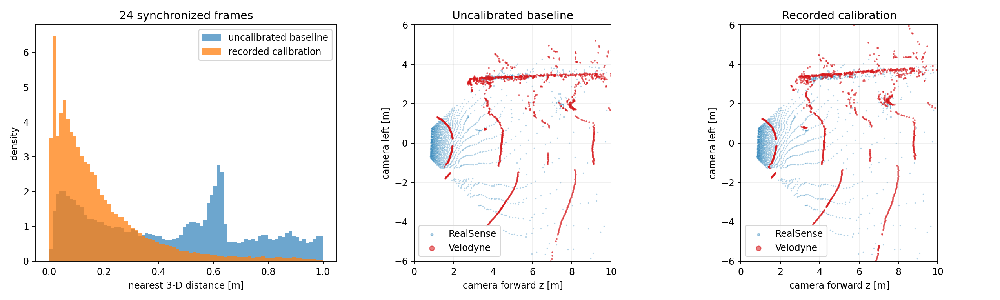

# D555–Velodyne calibration consistency report

## Result

The recorded extrinsic is strongly supported as a useful calibration. It reduces the median cross-sensor nearest-point residual by
**79.7%** relative to a physically uncalibrated control.

| Metric | Recorded calibration | Uncalibrated control |
|---|---:|---:|
| Median 3-D residual | 12.8 cm | 63.0 cm |
| 75th percentile | 25.4 cm | 112.7 cm |
| Points within 10 cm | 41.4% | 11.1% |
| Points within 20 cm | 67.0% | 19.8% |
| Points within 30 cm | 80.3% | 26.2% |

The evaluation used 24 frames spread across the bag and
101,246 Velodyne points in the RealSense
field of view (0.4–10 m). Selected pairs have a median absolute timestamp
difference of 10.2 ms and a maximum of
28.7 ms.

## Interpretation

This is good evidence that the recorded transform is substantially correct and
appropriate for coarse semantic point-cloud fusion. It is not enough to claim
centimetre-level absolute accuracy: there is no surveyed checkerboard/plane in
the bag, and general-scene nearest-neighbour residuals also include depth noise,
Velodyne angular sparsity, occlusion, platform motion, and timestamp error.

For a formal acceptance test, record a static calibration target visible to
both sensors, estimate plane/edge residuals on that target, and report
translation/rotation uncertainty over repeated captures.
